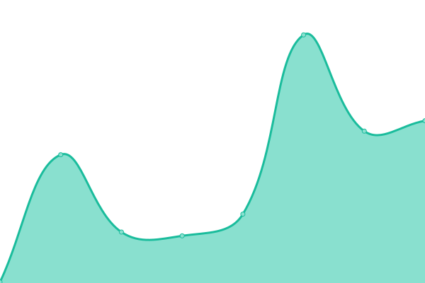

# [📈 Live Status](https://upptime.jcma.me): <!--live status--> **🟩 All systems operational**

This repository contains the open-source uptime monitor and status page for [Jiacheng Ma](https://jcma.me), powered by [Upptime](https://github.com/upptime/upptime).

With [Upptime](https://upptime.js.org), you can get your own unlimited and free uptime monitor and status page, powered entirely by a GitHub repository. We use [Issues](https://github.com/mjc0608/upptime/issues) as incident reports, [Actions](https://github.com/mjc0608/upptime/actions) as uptime monitors, and [Pages](https://upptime.jcma.me) for the status page.

<!--start: status pages-->
<!-- This summary is generated by Upptime (https://github.com/upptime/upptime) -->
<!-- Do not edit this manually, your changes will be overwritten -->
<!-- prettier-ignore -->
| URL | Status | History | Response Time | Uptime |
| --- | ------ | ------- | ------------- | ------ |
|  [Home Page](https://jcma.me) | 🟩 Up | [home-page.yml](https://github.com/mjc0608/upptime/commits/HEAD/history/home-page.yml) | 

 164ms
     
 | 

<a href="https://upptime.jcma.me/history/home-page">100.00%</a>
    

|  [Blog](https://blog.jcma.me) | 🟩 Up | [blog.yml](https://github.com/mjc0608/upptime/commits/HEAD/history/blog.yml) | 

 389ms
     
 | 

<a href="https://upptime.jcma.me/history/blog">100.00%</a>
    

|  [Vaultwarden](https://vault.jcma.me) | 🟩 Up | [vaultwarden.yml](https://github.com/mjc0608/upptime/commits/HEAD/history/vaultwarden.yml) | 

 295ms
     
 | 

<a href="https://upptime.jcma.me/history/vaultwarden">100.00%</a>
    

|  [SSO Service](https://auth.it.jcma.me) | 🟩 Up | [sso-service.yml](https://github.com/mjc0608/upptime/commits/HEAD/history/sso-service.yml) | 

 550ms
     
 | 

<a href="https://upptime.jcma.me/history/sso-service">100.00%</a>
    

|  [Gitea](https://gitea.it.jcma.me) | 🟩 Up | [gitea.yml](https://github.com/mjc0608/upptime/commits/HEAD/history/gitea.yml) | 

 489ms
     
 | 

<a href="https://upptime.jcma.me/history/gitea">100.00%</a>
    

<!--end: status pages-->

[**Visit our status website →**](https://upptime.jcma.me)

## 📄 License

- Powered by: [Upptime](https://github.com/upptime/upptime)
- Code: [MIT](./LICENSE) © [Jiacheng Ma](https://jcma.me)
- Data in the `./history` directory: [Open Database License](https://opendatacommons.org/licenses/odbl/1-0/)
